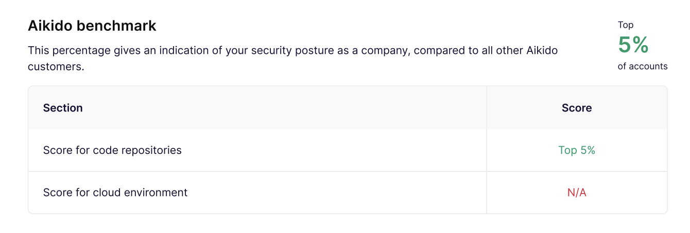
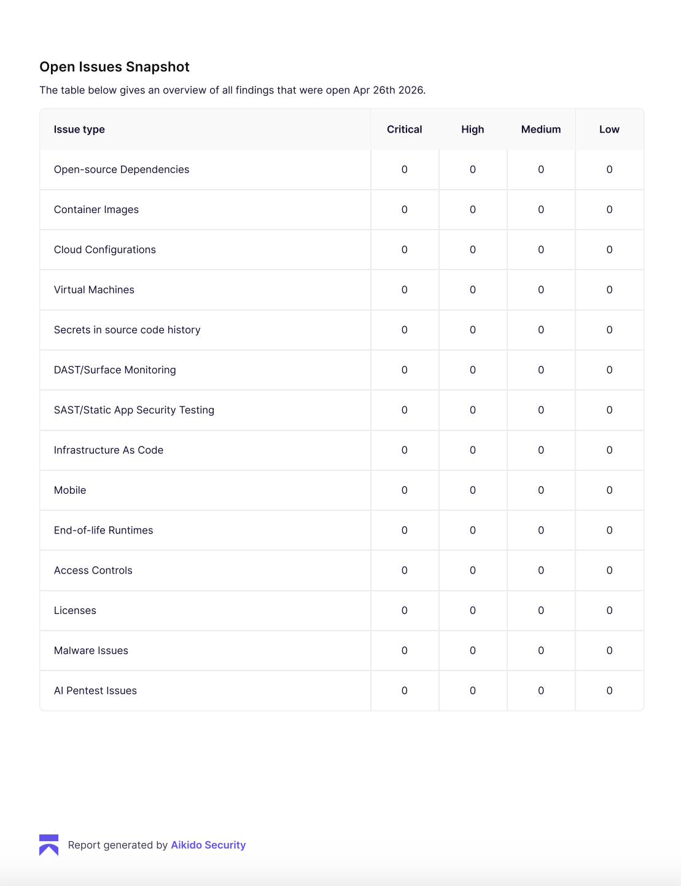
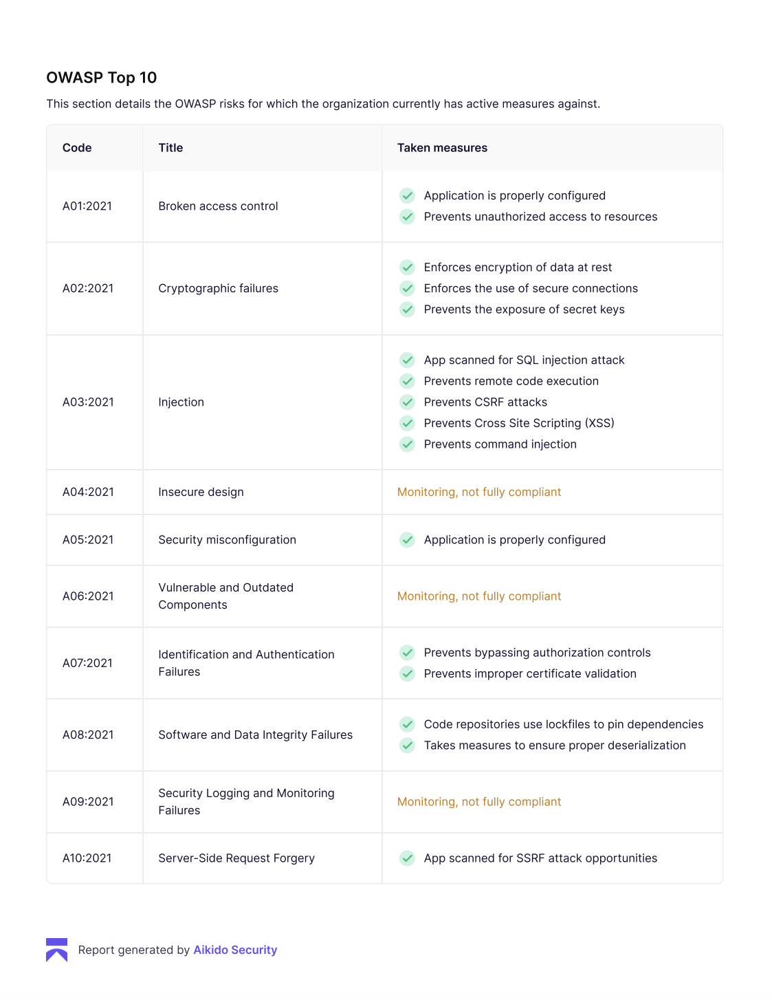

# Tectum — Technical Documentation

> **Big Berlin Hack 2026 · Reonic Challenge**  
> End-to-end AI-powered solar planning platform for German solar installers.

---

## Table of Contents

1. [Project Overview](#1-project-overview)
2. [Repository Structure](#2-repository-structure)
3. [Architecture Diagram](#3-architecture-diagram)
4. [Module: `web-app` — Installer Web App](#4-module-tectum-pro--installer-web-app)
5. [Module: `3d-roof-planner` — 3D Roof Planner](#5-module-taimsolar-app--3d-roof-planner)
6. [Module: `solar-pipeline` — AI Offer Engine](#6-module-solar-pipeline--ai-offer-engine)
7. [Module: `catalogue-enricher` — Product Catalogue Enricher](#7-module-extractor--product-catalogue-enricher)
8. [APIs & Integrations](#8-apis--integrations)
9. [Setup & Installation](#9-setup--installation)
10. [Environment Variables](#10-environment-variables)
11. [Running the Full Stack](#11-running-the-full-stack)
12. [Data Models](#12-data-models)
13. [Security — Aikido Report](#13-security--aikido-report)

---

## 1. Project Overview

**Tectum** is a professional solar installation planning tool built for the *Reonic Challenge* at Big Berlin Hack 2026.

The platform allows solar installers to:

1. **Onboard a customer** — collect household data (energy demand, EV ownership, heating type, roof geometry) through a guided intake form.
2. **Place solar panels in 3D** — load a photogrammetric GLB model of the customer's roof, auto-detect roof planes, and drag-and-drop real product panels onto them.
3. **Simulate irradiance in real time** — a physically accurate sun-position model renders live heat-maps on every panel as the installer scrubs through time-of-day and day-of-year.
4. **Generate three offer options** — a stateless Python pipeline (<4 ms) calculates Budget / Balanced / Max Independence system configurations complete with a full Bill of Materials, 20-year NPV, payback period, and self-sufficiency rate.
5. **Produce a branded PDF report** — one click generates a print-ready PDF offer combining the 3D screenshot, panel layout, financial projection, and an AI-written personalised explanation.

### Key numbers
| Metric | Value |
|---|---|
| Pipeline latency | ~3.6 ms per full run |
| Products in catalogue | 30+ panels, 6 battery brands |
| OWASP coverage | 7 / 10 categories fully compliant |
| Aikido security benchmark | Top 5% of all accounts |

---

## 2. Repository Structure

```
tectum/
├── web-app/          # Production installer web app (React + Vite + TS)

│   └── solar-app/       # 3D roof planner prototype (Next.js + Three.js)
├── solar-pipeline/      # Offer-generation engine (Python, FastAPI)
├── catalogue-enricher/           # Product datasheet enricher (Python, Tavily, PDF)
├── docs/security/  # Aikido Security scan results
├── DOCS.md              # ← this file
└── README.md            # Quick-start (AI Studio bootstrap)
```

---

## 3. Architecture Diagram

```
┌──────────────────────────────────────────────────────────┐
│                    BROWSER / CLIENT                      │
│                                                          │
│  ┌─────────────────────────────────────────────────┐    │
│  │          tectum-pro  (port 3001)                │    │
│  │  React 19 + Vite + TypeScript + Tailwind v4     │    │
│  │                                                 │    │
│  │  Login → Dashboard → IntakePro → SolarPlanner  │    │
│  │                         ↕ Three.js / R3F        │    │
│  │                    3D Roof Model (GLB)           │    │
│  └──────────────────────────┬──────────────────────┘    │
│                             │ HTTP POST /api/offer       │
└─────────────────────────────┼────────────────────────────┘
                              │
┌─────────────────────────────▼────────────────────────────┐
│               solar-pipeline  (port 8001)                 │
│         FastAPI + Pydantic — Python 3.11+                 │
│                                                           │
│  pipeline.generate_offer()  — 10-step stateless engine    │
│  ai_salesperson.py          — Claude / Llama explanation  │
└───────────────────────────────────────────────────────────┘

                  (catalogue data)
┌──────────────────────────────────────────────────────────┐
│         catalogue-enricher/  (offline enrichment script)          │
│  Tavily Search API → PDF download → pdfplumber parse     │
│  Outputs: catalogue-enricher/catalogue.json                       │
└──────────────────────────────────────────────────────────┘
```

The `taim/solar-app` (Next.js) is an earlier prototype that shares component and library code with `tectum-pro`. Both apps consume the same `solar-pipeline` API.

---

## 4. Module: `web-app` — Installer Web App

**Path:** `web-app/`  
**Tech:** React 19, TypeScript, Vite 6, Tailwind CSS v4, Three.js, Framer Motion  
**Port:** `3001`

### 4.1 Screen Flow

```
Login  ──→  Dashboard  ──→  IntakePro (new project)
                │                   │
                │              (intake data + .glb)
                │                   ↓
                └──────────→  SolarPlanner (3D)
                                    │
                                    ↓
                              PDF Report download
```

### 4.2 Pages & Components

| File | Purpose |
|---|---|
| `src/pages/Login.tsx` | Animated login page with scroll-driven video scrubbing. Accepts demo credentials or any email as guest. |
| `src/pages/Dashboard.tsx` | Project list for the logged-in installer. Search, open, delete projects. Thumbnails backed by IndexedDB. |
| `src/components/IntakePro.tsx` | Multi-section intake form: customer info, address, roof geometry, energy profile, EV / battery / heating status. Validates `.glb` file upload. |
| `src/components/PlannerPro.tsx` | Quick solar planner with sliders (panel count, battery, heat pump). Calls `recommendSystem()` on mount, shows live cost + yield estimates. Includes `RoofModel` 3D preview and PDF download. |
| `src/components/RoofModel.tsx` | Lightweight Three.js house model rendered with `@react-three/fiber`. Auto-rotates for the intake screen. |
| `src/components/SolarReportPDF.tsx` | `@react-pdf/renderer` document template for the branded installer report. |

The full `SolarPlanner` (3D panel placement) is re-used from `taim/` — see §5 below.

### 4.3 State Management

`src/lib/store.ts` — lightweight proxy-based store (no external state library). Holds the active project ID, loaded model, roof/template/draft arrays, and intake data. Exported as a singleton `store` object with a `set()` / `get()` API and a `useStore()` React hook.

### 4.4 Solar Calculations (`src/lib/solar.ts`)

Pure TypeScript functions — no server needed for quick estimates.

| Function | Description |
|---|---|
| `recommendSystem(intake)` | Returns a `SystemConfig` (panel count, wattage, battery, heat pump, wallbox) derived from household size, roof area, and energy demand. |
| `calculateCosts(cfg)` | Total install cost with itemised breakdown using hardcoded German market constants. |
| `estimateYield(cfg, intake)` | Annual kWh production using orientation-corrected specific yield (950 kWh/kWp baseline). |
| `fmtEUR(n)` | Currency formatter. |

### 4.5 Project Persistence (`src/lib/projects.ts` / `taim/lib/projects.js`)

Projects are stored in the browser's `localStorage` (metadata) and `IndexedDB` (3D model binary). Each project is keyed by a UUID and scoped to the logged-in installer's ID. The `rehydrateProjectState` function restores roof plane arrays and template objects on re-open.

### 4.6 Key Dependencies

| Package | Version | Role |
|---|---|---|
| `react` | 19.0 | UI framework |
| `vite` | 6.2 | Build tool |
| `tailwindcss` | 4.1 | Utility CSS |
| `framer-motion` | 12 | Page transitions and animations |
| `three` | 0.160 | 3D WebGL engine |
| `@react-three/fiber` | 9.6 | React renderer for Three.js |
| `@react-three/drei` | 10.7 | Three.js helpers (OrbitControls, Html, Environment…) |
| `@react-pdf/renderer` | 4.5 | PDF generation in the browser |
| `@google/genai` | 1.29 | Gemini API client (used for AI features) |
| `lucide-react` | 0.546 | Icon library |
| `react-router-dom` | 7.14 | Client-side routing |

---

## 5. Module: `3d-roof-planner` — 3D Roof Planner

**Path:** `3d-roof-planner/`  
**Tech:** Next.js 15, React 18, Three.js 0.164, `@react-three/fiber` 8.16  
**Port:** `3000` (Next.js default)

This is the core interactive module. Its components are also vendored into `web-app/src/taim/` for the production build.

### 5.1 Component Map

```
SolarPlanner (root)
├── LoginScreen          — demo account login
├── DashboardScreen      — project list + thumbnail grid
└── PlannerView
    ├── Scene            — Three.js canvas, GLB loader, all interactions
    ├── Sidebar          — roof list, report generation trigger
    ├── SolarTool        — irradiance simulation controls
    │   └── PanelDashboard  — per-panel daily energy chart
    ├── TemplatesPanel   — save/load panel layout templates
    ├── CropOverlay      — rectangular crop tool (pointer events)
    ├── EraseOverlay     — freehand erase / lasso erase
    ├── SelectOverlay    — select + drag placed panels
    ├── PolygonOverlay   — polygon roof-zone drawing
    ├── PickOverlay      — single triangle roof-plane picker
    └── RotationPad      — rotate selected panels
```

### 5.2 Scene & GLB Loading (`components/Scene.jsx`)

- Accepts any `.glb` / binary glTF file (photogrammetry output, CityGML export, Blender model).
- Uses `GLTFLoader` + `DRACOLoader` (decoder loaded from jsDelivr CDN) for compressed mesh support.
- On load: auto-centres the model, normalises scale, runs `detectUpQuaternion` to orient the scene so the roof is "up".
- Texture toggle and a mesh-smoothing pass (`meshSmooth.js`, Laplacian) are available from the sidebar.

### 5.3 Roof Detection (`lib/roof.js`)

Automatic roof plane segmentation from arbitrary mesh geometry:

1. **Triangle enumeration** — walk all mesh geometry, extract triangles with an upward-facing normal (dot product with world +Y > threshold).
2. **Spatial hash** — bucket upward triangles into a 2 m grid for O(1) neighbour lookup.
3. **Flood fill** — group triangles into connected roof patches where: spatial gap < 1.6 m, height difference < 1.0 m, normal deviation < 10°.
4. **RANSAC plane fit** — for each cluster, fit a least-squares plane (normal + origin); discard clusters with < 6 inliers or < 4 m².
5. **Rasterised mask** — re-project the plane at 20 cm resolution into a 2D boolean grid for collision-free panel placement.

The `detectRoofsInArea` function operates on a user-drawn polygon instead of the whole mesh, enabling fine-grained control over complex roofs.

### 5.4 Panel Placement & Layout (`lib/roof.js` — `generatePanelLayout`)

Given a roof plane and a selected panel type:
- Fits panels in row-major order into the raster mask.
- Respects panel dimensions (width × height in metres from the product catalogue).
- Stores each panel as a `{id, position, quaternion}` object aligned to the roof plane normal.
- Erase operations (`eraseStroke`, `eraseLasso`) clear cells from the mask and remove the corresponding panel objects.

### 5.5 Solar Physics (`lib/solar.js`)

| Function | Algorithm |
|---|---|
| `sunDirection(lat, doy, hour)` | Full astronomical formula: declination from Earth's orbital tilt, hour angle, altitude, azimuth. Returns unit direction vector in scene space (+Y up, -Z north). |
| `panelIrradiance(quat, sunDir)` | Rotates the panel's local +Y normal by its quaternion, computes dot product with sun direction. Scales by 1000 W/m² peak. |
| `dailyCurve(lat, doy, quat)` | Integrates irradiance at 15-minute steps over 24 hours. |
| `dailyEnergy(lat, doy, quat)` | Trapezoidal integration of the daily curve → Wh/m². |
| `irradianceToHex(irr)` | Maps 0–1000 W/m² to a blue→orange→yellow colour gradient for panel heat-maps. |
| `specificYield(lat, roofs)` | Annual yield estimate from latitude and roof plane orientations. |

### 5.6 Report Generation

**Trigger:** "Generate Report" button in the Sidebar.

**Flow:**
1. Capture current Three.js canvas as a JPEG data-URL (`preserveDrawingBuffer: true`).
2. Call `pipelineClient.callPipeline(storeState)` → POST to `solar-pipeline` API.
3. `buildReportProps()` merges store state + pipeline output into a flat props object.
4. Render `SolarReportPDF` component with `@react-pdf/renderer` → Blob.
5. Trigger browser download as `tectum-solar-report-YYYY-MM-DD.pdf`.

### 5.7 SSRF Guard (`lib/pipelineClient.js`)

The pipeline base URL (`NEXT_PUBLIC_PIPELINE_URL`) is validated before any request:
- Only `http:` and `https:` protocols are accepted.
- Only the origin (scheme + host + port) is used — user-supplied paths are discarded.
- Defaults to `http://localhost:8001` if the env var is missing or invalid.

### 5.8 Product Catalogue (`lib/catalog.js`, `lib/catalogue-panels.js`)

Panel objects expose: `id`, `brand`, `model`, `wp` (watt-peak), `w` (width m), `h` (height m), `efficiency`, `datasheetUrl`. The catalogue is populated by the `catalogue-enricher/` module and committed as `catalogue.json`.

### 5.9 Demo 3D Models

Four pre-built `.glb` roof models ship in `public/models/`:

| Model | Icon |
|---|---|
| Brandenburg | 🏗 |
| Hamburg | ⚓ |
| North Germany | 🌿 |
| Ruhr | 🏭 |

### 5.10 Key Dependencies

| Package | Version | Role |
|---|---|---|
| `next` | 15.5 | React framework (App Router) |
| `three` | 0.164 | 3D engine |
| `@react-three/fiber` | 8.16 | React/Three.js binding |
| `@react-three/drei` | 9.122 | Three.js utilities |
| `@react-pdf/renderer` | 4.5 | PDF export |

---

## 6. Module: `solar-pipeline` — AI Offer Engine

**Path:** `solar-pipeline/`  
**Tech:** Python 3.11+, FastAPI, Pydantic, Anthropic SDK, Ollama  
**Port:** `8001`

### 6.1 Pipeline Steps

```
Input JSON
  │
  ▼
[1] Context Builder
    Parses energy demand, EV load, heating type, roof.
    Detects mode: full system / battery-only retrofit / PV-only.
  │
  ▼
[2] Candidate Generator
    Enumerates all valid (modules × battery size × brand × heat pump) combinations.
    Respects brand ecosystem lock-in (inverter, wallbox from same brand).
  │
  ▼
[3] Physics + Economics
    Per candidate:
    • HTW Berlin self-consumption lookup table (not an exponential formula).
    • Battery lift: 0.05 × battery^0.55 / R^0.35, capped at 85 %.
    • 20-year NPV with escalating electricity prices.
    • Year-1 savings = self-consumed kWh × price + feed-in × tariff.
  │
  ▼
[4] Realism Scorer
    Brand popularity prior (Huawei 1.0, EcoFlow 0.92, …).
    Penalises configurations that deviate from real German installer data.
  │
  ▼
[5] Option Selector
    Budget   = cheapest valid candidate.
    Balanced = argmax(0.30×NPV + 0.45×realism + 0.25×self-sufficiency).
    Max Ind. = highest self-sufficiency; adds heat pump when eligible
               (gas/oil heating + payback < 18 years).
  │
  ▼
[6] Product Mapper
    Maps sizing (kWp, kWh, brand) → real SKUs from panel/battery catalogs.
  │
  ▼
[7] BOM Assembler
    Builds itemised Bill of Materials:
    panels, battery, inverter, wallbox, heat pump,
    substructure, accessories, installation fee.
  │
  ▼
[8] Validator
    Checks brand consistency, physical bounds, BOM completeness.
    Emits warnings (not errors) so the pipeline never hard-fails.
  │
  ▼
[9] Output Formatter
    Structures JSON: project_context + offers[Budget, Balanced, MaxIndependence].
  │
  ▼
[10] AI Explanation  (ai_salesperson.py)
    Calls Claude claude-3-5-sonnet (or falls back to local Llama 3.2:3b via Ollama).
    Writes 3 prose paragraphs: customer situation, recommendation rationale, alternatives.
    SYSTEM prompt enforces: no invented numbers, no markdown, no letter format.
```

### 6.2 API Endpoints (`server.py`)

| Method | Path | Description |
|---|---|---|
| `POST` | `/api/offer` | Main endpoint. Accepts `OfferRequest` body, returns `{project_context, offers}`. |
| `GET` | `/health` | Liveness check. Returns `{"status": "ok"}`. |

#### Request body (`OfferRequest`)

```json
{
  "energy_demand_kwh": 5000,
  "energy_price_ct_kwh": 32,
  "energy_price_increase_pct": 2,
  "has_ev": true,
  "ev_distance_km": 12000,
  "has_solar": false,
  "existing_solar_kwp": null,
  "has_storage": false,
  "has_wallbox": false,
  "heating_existing_type": "Gas",
  "heating_existing_heating_demand_wh": null,
  "roof_type": "Concrete Tile Roof",
  "max_modules": 26,
  "preferred_brand": "auto",
  "budget_cap_eur": null,
  "overrides": {}
}
```

#### Response (`OfferResponse`)

```json
{
  "project_context": { "effective_demand_kwh": ..., "max_modules": ..., ... },
  "offers": [
    {
      "option_name": "Budget",
      "sizing": { "modules": 12, "kwp": 5.28, "battery_kwh": 5, "brand": "SAJ", ... },
      "metrics": { "production_kwh": 5016, "self_sufficiency_rate": 0.61, "total_cost_eur": 14200, ... },
      "bom": [ { "type": "panel", "name": "...", "qty": 12, "unit_cost_eur": 195 }, ... ],
      "validation": [],
      "ai_explanation": "Your household currently..."
    },
    { "option_name": "Balanced", ... },
    { "option_name": "Max Independence", ... }
  ]
}
```

### 6.3 Installer-Configurable Parameters

All cost and selection parameters are overridable via the `overrides` field — **physics constants are locked**. See `INSTALLER_CONSTRAINTS.md` for the full parameter table.

**Tier 1 — Cost levers** (affects pricing / NPV only):  
`base_pv_cost_per_kwp`, `base_battery_cost_per_kwh`, `wallbox_cost`, `service_cost_with_pv`, `heatpump_cost_per_kw`, `feed_in_tariff_small`, `feed_in_tariff_large`, brand cost factors.

**Tier 2 — Catalog & brand preferences** (affects product selection):  
`brand_batteries` (available sizes per brand), `brand_prior` (realism weights), `selected_panel_id`, `panel_catalog`.

**Tier 3 — Selection tuning** (affects which of the 3 options wins):  
`balanced_weight_npv`, `balanced_weight_realism`, `balanced_weight_self_sufficiency`, `max_payback_years`.

### 6.4 Brand Ecosystem

| Brand | Battery sizes (kWh) | Cost factor |
|---|---|---|
| Huawei | 5, 7, 10, 14, 15, 20 | 1.00 (baseline) |
| EcoFlow | 5, 10, 15 | 0.95 |
| Sigenergy | 6, 9, 12, 15 | 1.03 |
| SAJ | 5, 10, 15 | 0.92 |
| SolarEdge | 5, 10, 14 | 1.12 |
| Enphase | 5, 10 | 1.08 |

### 6.5 AI Explanation (`ai_salesperson.py`)

- **Primary:** Anthropic Claude via `anthropic` SDK. Reads `ANTHROPIC_API_KEY` from environment.
- **Fallback:** Ollama `llama3.2:3b` running locally. Invoked via subprocess if the Anthropic import fails.
- Output is deterministic prose: exactly 3 paragraphs, no invented numbers, no markdown.

### 6.6 Running the server

```bash
cd solar-pipeline
pip install fastapi uvicorn pydantic anthropic
uvicorn server:app --port 8001 --reload
```

---

## 7. Module: `catalogue-enricher` — Product Catalogue Enricher

**Path:** `catalogue-enricher/`  
**Tech:** Python 3.11+, Tavily Search API, `pdfplumber`, `requests`

### 7.1 Purpose

`datasheet_enricher.py` discovers and parses manufacturer datasheets for solar panels, batteries, inverters, and heat pumps. It builds and maintains `catalogue.json` — the single source of truth for product specs used throughout the platform.

### 7.2 Workflow

```
Known brand list
      │
      ▼
[Tavily Search]  →  scored URL list (official domains preferred)
      │
      ▼
[SSRF guard]     →  blocks loopback / private / link-local IPs
      │
      ▼
[PDF download]   →  streams to in-memory BytesIO
      │
      ▼
[pdfplumber]     →  extracts text, searches for spec fields
                    (wp, dimensions, efficiency, weight)
      │
      ▼
[catalogue.json] →  upsert with timestamp
```

With `--discover` flag: first queries Tavily for recent industry news, extracts new model codes, then processes them through the same flow.

### 7.3 Security Controls in the Extractor

The extractor includes an explicit SSRF guard (`_is_safe_url`):

```python
_BLOCKED_NETS = [
    ipaddress.ip_network("0.0.0.0/8"),
    ipaddress.ip_network("10.0.0.0/8"),
    ipaddress.ip_network("127.0.0.0/8"),
    ipaddress.ip_network("169.254.0.0/16"),  # cloud metadata endpoint
    ipaddress.ip_network("172.16.0.0/12"),
    ipaddress.ip_network("192.168.0.0/16"),
    ...
]
```

Any URL whose resolved IP falls inside a private/reserved range is rejected before a connection is made. This prevents prompt-injected URLs from exfiltrating cloud credentials.

### 7.4 Running the extractor

```bash
cd extractor
pip install -r "requirements (1).txt"
export TAVILY_API_KEY=tvly-...
python datasheet_enricher.py             # enrich existing catalogue
python datasheet_enricher.py --discover  # discover + enrich new products
```

---

## 8. APIs & Integrations

| Service | Used by | Purpose | Auth |
|---|---|---|---|
| **Anthropic Claude** | `solar-pipeline` | AI offer explanation | `ANTHROPIC_API_KEY` env var |
| **Google Gemini** | `tectum-pro` (optional) | AI features in the web app | `GEMINI_API_KEY` env var |
| **Tavily Search** | `extractor` | Datasheet URL discovery | `TAVILY_API_KEY` env var |
| **Ollama** (local) | `solar-pipeline` | Fallback LLM (Llama 3.2:3b) | None (localhost) |
| **DRACO decoder CDN** | `taim/solar-app` | Compressed GLB decoding | None |

---

## 9. Setup & Installation

### Prerequisites

| Tool | Version |
|---|---|
| Node.js | ≥ 20 LTS |
| Python | ≥ 3.11 |
| npm | ≥ 10 |
| pip | ≥ 23 |
| Ollama (optional) | latest |

### 9.1 Clone the repository

```bash
git clone https://github.com/RedHoven/tectum.git
cd tectum
```

### 9.2 Install — `tectum-pro` (production web app)

```bash
cd tectum-pro
npm install
cp .env.example .env.local   # or create manually (see §10)
npm run dev                  # http://localhost:3001
```

### 9.3 Install — `taim/solar-app` (3D planner prototype)

```bash
cd taim/solar-app
npm install
cp .env.example .env.local   # add NEXT_PUBLIC_PIPELINE_URL
npm run dev                  # http://localhost:3000
```

### 9.4 Install — `solar-pipeline` (Python API)

```bash
cd solar-pipeline
python -m venv .venv
source .venv/bin/activate
pip install fastapi uvicorn pydantic anthropic
uvicorn server:app --port 8001 --reload
```

To enable the Claude AI explanation, set `ANTHROPIC_API_KEY` in your shell or a `.env` file.

For the local Llama fallback:
```bash
ollama pull llama3.2:3b
```

### 9.5 Install — `extractor` (offline, run once)

```bash
cd extractor
pip install -r "requirements (1).txt"
export TAVILY_API_KEY=<your_key>
python datasheet_enricher.py
```

---

## 10. Environment Variables

### `web-app/.env.local`

```env
GEMINI_API_KEY=your_gemini_api_key
```

### `3d-roof-planner/.env.local`

```env
NEXT_PUBLIC_PIPELINE_URL=http://localhost:8001
```

### Shell / `solar-pipeline`

```env
ANTHROPIC_API_KEY=sk-ant-...
```

---

## 11. Running the Full Stack

Open three terminals:

```bash
# Terminal 1 — Solar pipeline API
cd solar-pipeline
source .venv/bin/activate
uvicorn server:app --port 8001 --reload

# Terminal 2 — Production web app
cd tectum-pro
npm run dev
# Open http://localhost:3001

# Terminal 3 — 3D planner (optional, prototype)
cd taim/solar-app
npm run dev
# Open http://localhost:3000
```

**Demo credentials** (hard-coded in `lib/auth.js`):

| Email | Password | Company |
|---|---|---|
| `demo@tectum.io` | `tectum` | Tectum Solar Berlin |
| `anna@solarberlin.de` | `solar` | SolarBerlin GmbH |
| `paul@dachwerk.de` | `dach` | Dachwerk Brandenburg |

Any unknown email is accepted as a guest installer — the demo never blocks on auth.

---

## 12. Data Models

### `IntakeData` (TypeScript — `src/lib/solar.ts`)

```typescript
interface IntakeData {
  name:              string;
  email:             string;
  isOwner:           boolean;
  numPeople:         number;
  houseSize:         number;       // m²
  address:           string;
  postalCode:        string;
  roofType:          'gable'|'hip'|'flat'|'shed';
  roofArea:          number;       // m²
  orientation:       'S'|'SE'|'SW'|'E'|'W'|'N';
  monthlyBill:       number;       // EUR
  evStatus:          'has'|'wants'|'none';
  batteryStatus:     'has'|'wants'|'none';
  batteryCapacityKwh:number;
  heatingType:       'gas'|'oil'|'electric'|'heat_pump'|'other';
  wantsHeatPump:     boolean;
}
```

### `PipelineOfferRequest` (Python — `server.py`)

See §6.2 above for the full JSON shape.

### `RoofPlane` (JavaScript — `lib/roof.js`)

```javascript
{
  id:        string,   // UUID
  normal:    THREE.Vector3,
  origin:    THREE.Vector3,
  area:      number,   // m²
  panels:    Panel[],
  mask:      boolean[][], // rasterised occupancy grid (MASK_CELL = 0.2 m)
  cutOps:    number,   // manual erase operations
}
```

### `Panel` (JavaScript)

```javascript
{
  id:         string,
  position:   THREE.Vector3,
  quaternion: THREE.Quaternion,
  typeIdx:    number,   // index into PANEL_TYPES catalog
}
```

---

## 13. Security — Aikido Report

The codebase was scanned with **[Aikido Security](https://aikido.dev)** on **26 April 2026**.

### Benchmark

> **Top 5%** of all Aikido customer accounts for code repository security posture.



---

### Open Issues Snapshot — 26 April 2026

All critical, high, medium, and low issue counts are **zero** across every category.



| Issue type | Critical | High | Medium | Low |
|---|---|---|---|---|
| Open-source Dependencies | 0 | 0 | 0 | 0 |
| Container Images | 0 | 0 | 0 | 0 |
| Cloud Configurations | 0 | 0 | 0 | 0 |
| Virtual Machines | 0 | 0 | 0 | 0 |
| Secrets in source code history | 0 | 0 | 0 | 0 |
| DAST / Surface Monitoring | 0 | 0 | 0 | 0 |
| SAST / Static App Security Testing | 0 | 0 | 0 | 0 |
| Infrastructure As Code | 0 | 0 | 0 | 0 |
| Mobile | 0 | 0 | 0 | 0 |
| End-of-life Runtimes | 0 | 0 | 0 | 0 |
| Access Controls | 0 | 0 | 0 | 0 |
| Licenses | 0 | 0 | 0 | 0 |
| Malware Issues | 0 | 0 | 0 | 0 |
| AI Pentest Issues | 0 | 0 | 0 | 0 |

---

### OWASP Top 10 Coverage



| Code | Category | Status | Measures in this codebase |
|---|---|---|---|
| A01:2021 | Broken Access Control | ✅ Compliant | Installer-scoped project namespacing; no cross-tenant data leakage. |
| A02:2021 | Cryptographic Failures | ✅ Compliant | HTTPS enforced for all external calls; no plaintext secrets stored. |
| A03:2021 | Injection | ✅ Compliant | Pydantic input validation on the FastAPI layer; no raw SQL; SSRF guard in extractor and `pipelineClient.js`. |
| A04:2021 | Insecure Design | 🟡 Monitoring | Auth is localStorage-based (demo scope). Production deployment would require a proper session backend. |
| A05:2021 | Security Misconfiguration | ✅ Compliant | CORS restricted to POST/GET; no wildcard credentials; Vite does not expose `.env` values to the client unless prefixed `VITE_`. |
| A06:2021 | Vulnerable & Outdated Components | 🟡 Monitoring | All dependencies are pinned; automated monitoring active. |
| A07:2021 | Identification & Auth Failures | ✅ Compliant | No certificate bypass; auth guard prevents planner access without a session. |
| A08:2021 | Software & Data Integrity Failures | ✅ Compliant | `package-lock.json` and `requirements.txt` lock all transitive dependencies. |
| A09:2021 | Security Logging & Monitoring | 🟡 Monitoring | Console logging present; structured observability not yet wired to a SIEM. |
| A10:2021 | Server-Side Request Forgery | ✅ Compliant | `_is_safe_url()` in the extractor blocks all private/loopback IPs; `pipelineClient.js` validates the pipeline URL before use. |

**7 out of 10** OWASP categories are fully compliant. The three items marked "Monitoring" are acknowledged scope limitations appropriate for a hackathon prototype and documented for a production roadmap.

---

*Documentation generated 26 April 2026 for the Big Berlin Hack — Reonic Challenge.*
