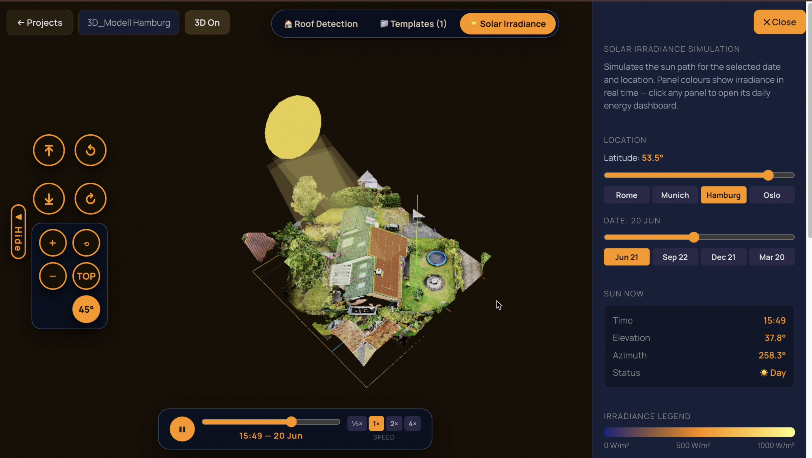

<p align="center">
  
</p>

<h1 align="center">Tectum</h1>

<p align="center">
  <strong>AI-powered solar planning & offer generation for German installers</strong>
</p>

<p align="center">
  
  
</p>

<p align="center">
  <a href="https://drive.google.com/file/d/1xPI4pHy9N9mXlTn9EcUOaoO6y3OIatFe/view?usp=drive_link">Demo Video</a> ·
  <a href="#how-it-works">How It Works</a> ·
  <a href="#quick-start">Quick Start</a> ·
  <a href="DOCS.md">Full Documentation</a>
</p>

<p align="center">
  
</p>

---

## How It Works

Tectum lets a solar installer walk through a complete sales workflow in minutes:

1. **Intake** — collect customer data (energy demand, EV, heating, roof geometry) via a guided form.
2. **3D Roof Planning** — load a GLB roof model, auto-detect roof planes, drag real panels onto them, and see live irradiance heat-maps.
3. **AI Offer Generation** — a sub-4 ms Python pipeline produces three fully-costed options (Budget / Balanced / Max Independence) with a complete Bill of Materials and 20-year financial projection.
4. **PDF Report** — one click generates a branded, print-ready offer with a 3D screenshot and an AI-written personalised explanation.

---

## Repository Structure

```
tectum/
├── web-app/               # Installer web app (React 19 + Vite + TypeScript)
├── 3d-roof-planner/       # 3D roof planner (Next.js 15 + Three.js)
├── solar-pipeline/        # Offer-generation engine (Python / FastAPI)
├── catalogue-enricher/    # Standalone product catalogue enricher (Tavily + pdfplumber)
└── docs/                  # Hero image & Aikido security scan results
```

---

## Quick Start

### Prerequisites

- **Node.js** >= 20 LTS
- **Python** >= 3.11

### One command

```bash
./start.sh
```

This installs dependencies and boots all three services:

| Service | URL |
|---|---|
| Web App | http://localhost:3001 |
| 3D Roof Planner | http://localhost:3000 |
| Solar Pipeline API | http://localhost:8001 |

### Manual setup

<details>
<summary>Run each service individually</summary>

**Solar Pipeline API**
```bash
cd solar-pipeline
python -m venv .venv && source .venv/bin/activate
pip install fastapi uvicorn pydantic anthropic
uvicorn server:app --port 8001 --reload
```

**Web App**
```bash
cd web-app
npm install && npm run dev
# → http://localhost:3001
```

**3D Roof Planner**
```bash
cd 3d-roof-planner
npm install && npm run dev
# → http://localhost:3000
```

</details>

> **Note:** `catalogue-enricher/` is a standalone Python script for enriching product datasheets — it is not required to run the main app.

---

## Tech Stack

| Layer | Stack |
|---|---|
| Frontend | React 19, TypeScript, Vite 6, Tailwind CSS v4, Framer Motion |
| 3D | Three.js, @react-three/fiber, @react-three/drei |
| PDF | @react-pdf/renderer |
| Backend | Python 3.11, FastAPI, Pydantic |
| AI | Anthropic Claude, Ollama Llama 3.2, Google Gemini |

---

## Security

Awarded **Most Secure Project** (Aikido Challenge) at Big Berlin Hack 2026.

- **Top 5%** of all Aikido accounts for code repository security posture
- **Zero** open issues across all 14 categories (Critical / High / Medium / Low)
- **7/10 OWASP Top 10** categories fully compliant

See [DOCS.md](DOCS.md) for the full report with screenshots.

---

## License

MIT
